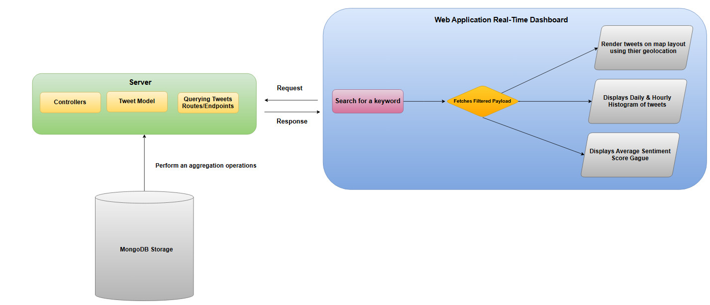

# Spark Tweets Tracker App

This project is a web application with a dashboard interface that tracks tweets by displaying the geographic coordinates of each tweet, creating a time-scaled histogram, and displaying the results of sentiment analysis.

## Description

<br>

- **The application aims to track the real-time flow of users' tweets. The first stage involves providing a user interface with a text field, where users can search for tweets by entering a specific keyword. Behind the scenes, a query is processed for the streamed tweets stored in MongoDB, and the filtered tweets are retrieved. A browsing process is then conducted on the map using the coordinates of the recorded points. The data is continuously updated in real-time through live requests, utilizing the Socket.IO library.**

<br>

- **Next, sentiment analysis is performed on each of the filtered tweets. A sentiment score is calculated for each tweet, and the average score is displayed on an indicator.**

<br>

- **Finally, a histogram is generated to represent the daily and hourly distribution of the streamed tweets.**

  <br><br><br>



## Getting Started

## Dependencies

- **Axios**  
  Library: `axios`  
  Version: `v1.7.9`

- **CORS**  
  Library: `cors`  
  Version: `v2.8.5`

- **Express.js**  
  Library: `express`  
  Version: `v4.21.2`

- **Mongoose**  
  Library: `mongoose`  
  Version: `v8.8.4`

- **Node-Geocoder**  
  Library: `node-geocoder`  
  Version: `v4.4.1`

- **Nodemon**  
  Library: `nodemon`  
  Version: `v3.1.7`

- **Socket.io**  
  Library: `socket.io`  
  Version: `v4.8.1`
- **Socket.io-client**  
  Library: `socket.io-client`  
  Version: `v4.8.1`
  
- **React-Chartjs-2**  
Library: `react-chartjs-2`  
Version: `v5.3.0`
 - **React-Leaflet**  
Library: `react-leaflet`  
Version: `v4.2.1`
   
  


### Installing

- Clone the project into your preferd directory

```
git clone  https://github.com/AhmadHudhud83/SparkTweetTracker---Big-Data-Project.git
```

### Executing the Program

**How to Run the Program**

 **Set Up Client/Server Environments:**

   - After cloning the project , Open the terminal and type the following command:
      and run the following command:
     ```bash
     cd server
     npm insatll 
     ```
  - Next , run the server using the following command: 
    ```bash
     npm start
     
    ```

   - Now open a new terminal window for setting up the Client's Environment,
   and write the following commands : 
   
     ```bash
     cd client
     npm install
     ```
  - Then exectue the React Application using the following command : 
    ```bash
    npm start
    ```
  - Then a new window will open in your default browser with link "localhost:3000" , and then you can get started with the application.


### Help

- **When Opening the Project** <br>
 Make sure all dependencies are correctly installed in your whole envoirnment.

## Authors

Contributors names and contact info

- [@Ahmad Hudhud](https://github.com/AhmadHudhud83)
- [@Momen Raddad](https://github.com/momenraddad)
- [@Bayan Abdalhaq](https://github.com/bayan7abdalhq)
  

## Acknowledgments & Sources

- [Nodejs Tutorial](https://www.youtube.com/playlist?list=PL5gCk5NdNx586mk_JOhe30dd59IgrFG_U&si=YTsWSO8gTtUrJEOB)
- [Leafletjs Map Rendering](https://leafletjs.com/reference.html)
- [MongoDB ](https://www.mongodb.com/docs/manual/core/document/)
- [MERN Stack Tutorial](https://www.youtube.com/watch?v=Akt98GIXArg)
- [Chartjs for Histogram Distribution & For Sentiment Analysis Gauge ](https://www.chartjs.org/docs/latest/)
- [Socket.io for low latency & real-time dashboard ](https://socket.io/docs/v4/)
